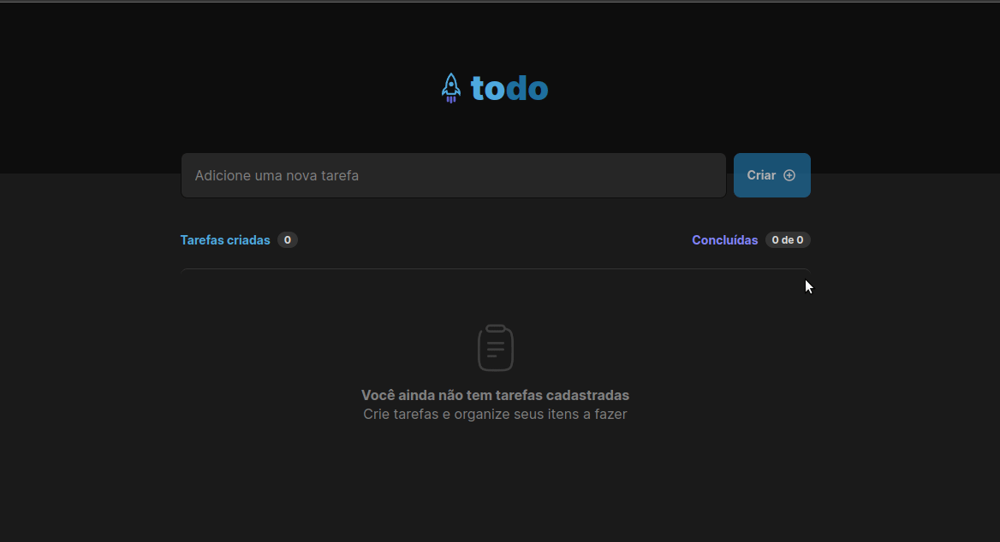

<p align="center"> 

</p>
<hr>

<p align="center">
  <a href="#-tecnologias">Tecnologias</a>&nbsp;&nbsp;&nbsp;|&nbsp;&nbsp;&nbsp;
  <a href="#-projeto">Projeto</a>&nbsp;&nbsp;&nbsp;|&nbsp;&nbsp;&nbsp;
  <a href="#-como-executar">Como executar</a>
</p>



## 🚀 Tecnologias

Esse projeto foi desenvolvido utilizando

- [Vite](https://vitejs.dev/)
- [React](https://reactjs.org/)
- [TypeScript](https://www.typescriptlang.org/)
- [Node e NPM](https://nodejs.org/)

## 💻 Projeto

O projeto é uma aplicação de controle de tarefas no estilo to-do list, com as funcionalidades:
- Adicionar uma nova tarefa
- Marcar e desmarcar uma tarefa como concluída
- Remover uma tarefa da listagem
- Mostrar o progresso de conclusão das tarefas
- As tarefas são salvas no [localStorage](https://developer.mozilla.org/pt-BR/docs/Web/API/Window/localStorage) do navegador

## 🚀 Como executar

Para clonar e rodar esse projeto, é necessário ter o [Git](https://git-scm.com), e o [Node.js](https://nodejs.org/en/download/) (que vem com o [npm](https://docs.npmjs.com/)) instalados no seu computador.

<br>

Clone este repositório
```bash
git clone https://github.com/ilismarque/todo
```

Instale as dependências (utilizei o npm, mas sinta-se à vontade para utilizar outro gerenciador)
```bash
npm install
```

Rode a aplicação
```bash
npm run dev
```
Acesse [`localhost:5173`](http://localhost:5173) no seu navegador.
